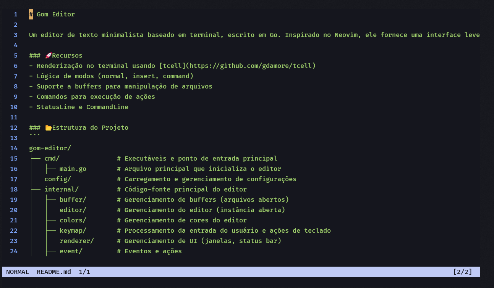

# Gom Editor 


Um editor de texto minimalista baseado em terminal, escrito em Go. Inspirado no Neovim, ele fornece uma interface leve e eficiente para edição de texto diretamente do terminal.

### 🚀 Recursos
- Renderização no terminal usando [tcell](https://github.com/gdamore/tcell)
- Lógica de modos (normal, insert, command)
- Suporte a buffers para manipulação de arquivos
- Comandos para execução de ações
- StatusLine e CommandLine 

### 📂 Estrutura do Projeto
```
gom-editor/
├── cmd/               # Executáveis e ponto de entrada principal
│   ├── main.go        # Arquivo principal que inicializa o editor
├── config/            # Carregamento e gerenciamento de configurações
├── internal/          # Código-fonte principal do editor
│   ├── buffer/        # Gerenciamento de buffers (arquivos abertos)
│   ├── editor/        # Gerenciamento do editor (instância aberta)
│   ├── colors/        # Gerenciamento de cores do editor
│   ├── keymap/        # Processamento da entrada do usuário e ações de teclado
│   ├── renderer/      # Gerenciamento de UI (janelas, status bar)
│   ├── event/         # Eventos e ações
│   ├── screen/        # Renderização da tela 
│   ├── utils/         # Funções reutilizáveis  
├── go.mod             # Arquivo de dependências do Go
├── go.sum             # Checksum das dependências
├── README.md          # Documentação do projeto
```

### 🛠 Instalação

##### Dependências
- [Go](https://go.dev/)
- Git

1.  Clone e acesse o repositório 
```bash
git clone https://github.com/jhenriquem/Gom
cd Gom
```

2. Instale todas os pacotes
```bash
go mod tidy
```
3. Compile e execute 
```bash
go build -o Gom.exe ./cmd/main.go

./Gom.exe 
```


### ⌨️ Keymaps e Comandos  
📍 Os estilo de movimentação e os comandos foram inspirados no neovim

<details>
<summary> 🗺️ Keymaps </summary>


| Mode | Key | Ação|
|------|-----|--------|
| Normal    | i   | modo insert  
| | : | Abrir commandline  
| | h,j,k,l | Movimentação
| Insert | ESC | sair do modo insert

</details>

<details>
<summary> ⚡Comandos </summary>


| Comando | Ação |
|-----------|----|
| w [ file ]| Salvar arquivo |
| q   | Sair|
| e [ file ]| Abrir um arquivo |
| bn | Próximo buffer|
| bp | Buffer anterior|
| bd | Deletar buffer atual|

</details>

#### 📌 Ispirações
- [Neovim](https://github.com/neovim/neovim) Vim-fork focado em extensibilidade e usabilidade
- [Gkilo](https://github.com/vcnovaes/gkilo) Um editor de texto escrito em Go

#### 🤝 Contribuição

Sinta-se à vontade para abrir issues e enviar pull requests!

#### 📜 Licença

Este projeto é distribuído sob a licença MIT.
